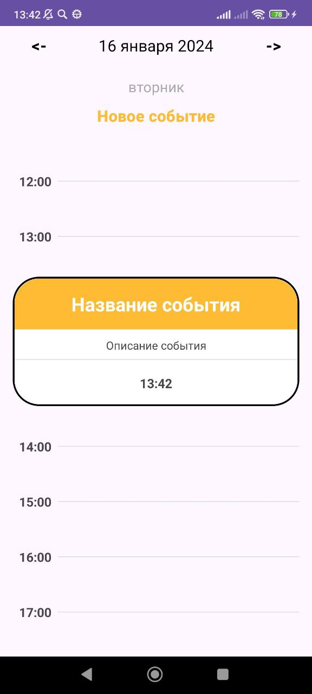
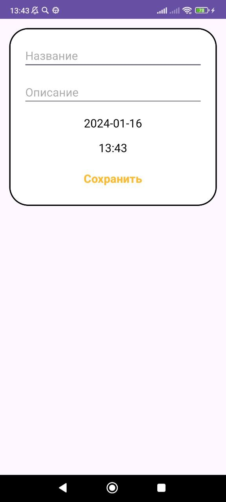
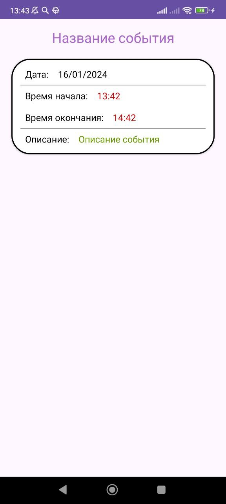

# Мобильное приложение "Ежедневник"
Тестовое задание на Android разработчика в Simbirsoft

# Скриншоты приложения
|                   Экран 1                    |                   Экран 2                    |                   Экран 3                    |
|:--------------------------------------------:|:--------------------------------------------:|:--------------------------------------------:|
|  |  |  |

## Технические характеристики

- Язык: Kotlin
- IDE: Android Studio
- Архитектура: MVVM
- Зависимости: Dagger2
- База данных: Room
- Навигация: Jetpack Navigation
- Работа c JSON: GSON
- Управление версиями: GitHub
- Чистый код: SOLID

### Ветки на github
- main - ветка, хранящая стабильную версию приложения с экраном добавления нового события.
- dev - ветка для разработки новой функциональности.

## Функциональность

#### Работа с файлом JSON.

- Приложение работает с json файлом следующей структуры:
```JSON
{
  "id":"1",
  "date_start":"1703981181",
  "date_finish":"1703981181",
  "name":"DemoTask",
  "description":"DemoDescription"
}
````
- Файл events.json расположен в папке app/src/main/assets/. При запуске приложения происходит 
  загрузка события из этого файла, просмотреть его можно в приложении по дате 31 декабря 2023.

#### Навигация между датами на главном экране
- Навигация между датами на главном экране осуществляется с помощью кнопок <- или ->

#### Добавление нового события
- При нажатии на кнопку "Новое событие" на главном экране приложения происходит переход на экран с добавлением нового события.
- После нажатия на кнопку "Сохранить", новое событие сохраняется в БД Room, а также отображается в элементе списка RecyclerView.

#### Детальная информация о событии
- При нажатии на элементе списка RecyclerView происходит переход на экран с детальным описанием события.